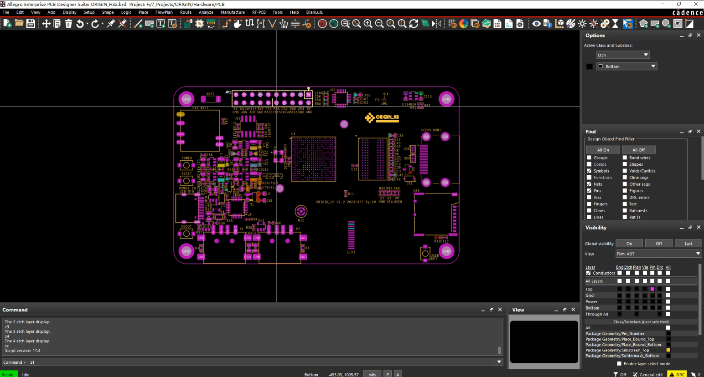

## ORIGIN_H3

* 硬件采用Allegro软件设计(Capture CIS 17.4 + PCB Editor 17.4)，使用相同及以上版本即可打开。
## Garber文件
* 电路板打样需要使用到Garber文件，已经导出在__ORIGIN_H3_Garber.rar__文件内。
## Allegro软件安装参考
[阿狸狗破戒大师 | 吴川斌的博客 (mr-wu.cn)](http://aligou.mr-wu.cn/)。
## 硬件优化
由于up只进行了一次打板（自费），在后期难免的遇到了一些问题，大部分都是因为板层不够多（四层）导致的，**但不影响第一板的正常运行**。up时间有限，未能作出更改，如果有后来者复刻，可以上六层板，进一步缩小体积，方便布线，项目硬件上可改进之处列在下面：
  * IMU丝印错误
  * USB封装有误
  * HDMI未进行等长布线
  * 摄像头接口电路有误（视频中使用的是USB摄像头）
  * MIC走线未包地处理
  * 音频输出电路走线未包地处理
  * 丝印C44和C41电容接触过近
  * 原理图中U13、U14芯片SY6280为USB限流芯片，可以直接将EN引脚接VCC，若未修改直接打板，需要使用磁阻或0欧姆电阻直接将输入和输出短接：
    